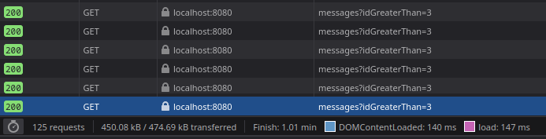
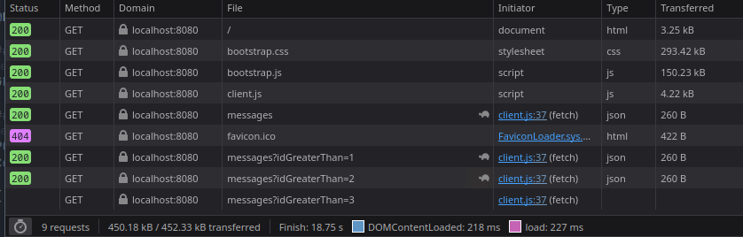

# Chat Applikation

## Allgemeines

Gegeben ist eine simple Chat-Applikation, die aus einem Browser Client und einem Express-basierten Server
besteht. Die Implementierungen sind jeweils in den Dateien `wwwPublic/client.js` und `server.js` zu finden.
Der Austausch der Nachrichten findet über den API Endpunkt `/api/messages` statt. Die Implementierung ist soweit
funktional, die Nachrichten müssen jedoch manuell per Button-Click aktualisiert werden. Machen Sie sich mit der Implementierung grundlegend vertraut. Das Backend kann weiters mit Hilfe der HTTP Requests in der Datei `tests.rest` getestet werden.

## Short Polling

Erweitern Sie die Implementierung, sodass mittels _short polling_ die Nachrichten in einem Intervall von 500 ms abgefragt
werden. Erweitern Sie die Server-Implementierung um einen Query-Parameter `idGreaterThan`, mit der der Client steuern kann,
ab welcher Message-Id die Nachrichten geliefert werden sollen. Dies dient dazu, dass nur neue - dem Client unbekannte - Nachrichten übertragen werden. Modifizieren Sie weiters den Client dahingehend, dass die Nachrichten in der bestehenden Liste ergänzt werden.

Das folgende Sequenzdiagramm sollte das Zusammenspiel zwischen Client und Server darstellen.

```plantuml

participant Alice << Browser >>
participant Server
participant Bob << Browser >>

activate Alice

Alice -> Server : GET /api/messages
note left: initially fetch all messages
activate Server
Server -> Alice: 200 OK\n[{"id":1,...},{"id":2,...}]
deactivate Server
|||

Alice -> Server : GET /api/messages?idGreaterThan=2
note left: check for new messages\nevery N milliseconds
activate Server
Server -> Alice: 200 OK\n[]
note left: no new messages so far
deactivate Server
|||
Alice -> Server : GET /api/messages?idGreaterThan=2
note left: check for new messages
activate Server
Server -> Alice: 200 OK\n[]
deactivate Server

activate Bob
Bob -> Server: POST /api/messages
note right: at some time,\na new message is posted
activate Server
Server -> Bob: 201 Created\n{"id":3,...}
note right: new message gets new id
deactivate Server

Alice -> Server : GET /api/messages?idGreaterThan=2
activate Server
Server -> Alice: 200 OK\n[{"id":3,...}]
note left: now the response\ncontains new message
deactivate Server
|||
Alice -> Server : GET /api/messages?idGreaterThan=3
note left: update query parameter
activate Server
Server -> Alice: 200 OK\n[]
deactivate Server

```

Testen Sie Ihre Implementierung indem Sie den Chat eine Minute im Client laufen lassen und 3 Nachrichten
mittels REST Client absenden. Bestimmen Sie mit Hilfe der Netzwerkanalyse in den Browser-Entwicklertools wie
viele Requests gesendet und wie viele Bytes dabei übertragen wurden.

Pro Sekunde werden ca 400B übertragen.



## Long Polling

Implementieren Sie in einem zweiten Schritt den Ansatz des _long polling_. Gehen Sie dabei wie folgt vor:

-   Es sollte über einen Request-Header `x-long-polling: true` signalisiert werden, dass _long polling_ zum Einsatz kommt.
-   Sollten neue Nachrichten am Server vorhanden sein, werden diese sofort im Response zurückgesendet.
-   Nach dem Erhalt der Response sendet der Client sofort wieder einen neuen Request ab.
-   Sollten keine Nachrichten vorliegen, so so sendet der Server zunächst keinen Response zurück, sondern _merkt_ sich,
    welche Responses noch unbeantwortet sind.
-   Sie können dazu in Ihrer Implementierung ein einfaches globales Array verwenden.
-   Wird über einen `POST` Request eine neue Nachricht eingefügt, muss beim _long polling_ nun überprüft werden, ob
    es noch wartende Responses gibt.
-   Ist dies der Fall wird die Nachricht in einem Array an den Client gesendet.
-   Natürlich können bei einer echten Anwendung mehrere Responses auf die Nachrichten warten.

Der Ablauf ist in folgendem Sequenzdiagramm zusammengefasst:

```plantuml

participant Alice << Browser >>
participant Server
participant Bob << Browser >>

activate Alice

Alice -> Server : GET /api/messages \nx-long-polling: true
note left: initially fetch all messages
activate Server
Server -> Alice: 200 OK\n[{"id":1,...},{"id":2,...}]
note right: messages available\nimmediately send response
deactivate Server
Alice -> Server : GET /api/messages?idGreaterThan=2\nx-long-polling: true
note left: check for new messages immediately
||50|
activate Server
note right: no messages available,\npostpone response

activate Bob
Bob -> Server: POST /api/messages
note right: at some time,\na new message is posted
activate Server
Server -> Bob: 201 Created\n{"id":3,...}
note right: new message gets new id
deactivate Server
Server -> Alice: 200 OK\n[{"id":3,...}]
note right: response to Alice is sent
note left: now the response\ncontains new message
deactivate Server
|||
Alice -> Server : GET /api/messages?idGreaterThan=3\nx-long-polling: true
note left: check for new messages immediately
activate Server

```

Testen Sie auch diese Implementierung indem Sie den Chat eine Minute im Client laufen lassen und 3 Nachrichten
mittels REST Client absenden. Bestimmen Sie mit Hilfe der Netzwerkanalyse in den Browser-Entwicklertools wie
viele Requests gesendet und wie viele Bytes dabei übertragen wurden.

Immer dann, wenn eine neue Nachricht eintrifft, werden 260B übertragen, wenn nicht, wird nichts übertragen.


