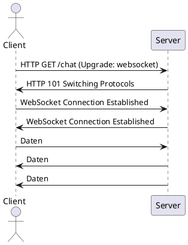

# h05-Answers

## WebSockets Allgemein

> Erklären Sie kurz das Konzept von WebSockets. Welche grundlegenden Unterschiede gibt es zum HTTP Protokoll?

WebSockets sind ein Protokoll, das eine persistente, bidirektionale Verbindung zwischen _Client_ und _Server_ ermöglicht. Beide Parteien können jederzeit Daten senden und empfangen ohne jedes Mal eine neue Verbindung aufzubauen.

Unterschiede zu HTTP:

-   HTTP ist zustandslos, jede Request erfordert eine neue Verbindung, WebSockets beginnen mit einem Handshake und enden erst, wenn die Verbindung explizit wieder geschlossen wird
-   HTTP ermöglicht dem Server lediglich auf bestehende Anfragen vom Client zu antworten, bei WebSockets können Daten jederzeit gesendet werden

## WebSockets vs. HTTP Polling

> Welche Vorteile bzw. Nachteile ergeben sich bei der Verwendung von WebSockets im Vergleich zu den bekannten HTTP Polling Ansätzen?

Vorteile:

-   Bei Websockeets fällt weniger "Overhead" an, das Netzwerk wird weniger belastet
-   Die Latenz ist bei WebSockets deutlich geringer als beim _Short-Polling_, auch gegenüber _Long-Polling_ sind WebSockets etwas schneller

Nachteile:

-   Die Implementierung von WebSocket-Verbindungen _kann_ komplexer ausfallen als Polling-Ansätze
-   WebSockets können aufgrund der bestehenden Verbindung inkompatibel mit anderen Systemen wie Firewalls, Proxys oder Load-Balancern sein
-   Bei sehr geringer Nutzung können WebSockets ineffizient sein, da die Verbindung dauerhaft offen gehalten wird

## HTTP Protocol Upgrade

> Erklären Sie anhand eines Sequenzdiagramms den Verbindungsaufbau bei der Verwendung von Web-Sockets.

> Welcher Zusammenhang mit dem HTTP Protokoll besteht?

-   Der Verbindungsaufbau wird durch einen HTTP-Handshake gelöst.
-   Der `Upgrade`-Header zeigt dem Server, dass der Client auf WebSockets umsteigen möchte.
-   Durch den Statuscode `101 Switching Protocols` wird die Kommunikation auf WebSockets umgestellt
