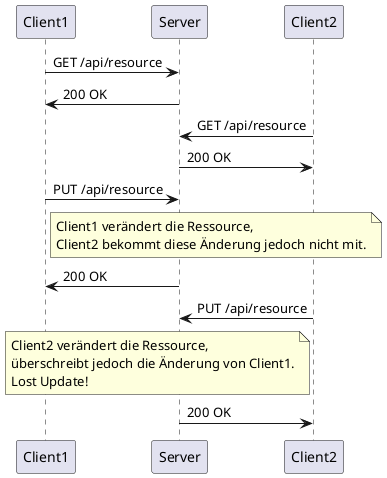

# Lost Update Problem

Das _Lost Update_ Problem tritt auf, wenn zwei Clients gleichzeitig auf eine Ressource zugreifen und diese verändern. Dabei wird die Änderung des einen Clients durch die des anderen Clients überschrieben, sodass die Änderung des ersten Clients verloren geht.

