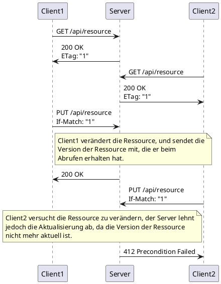

# Optimistic Locking

im Zusammenhang mit dem _lost update_ Problem.

Beim _Optimistic Locking_ wird davon ausgegangen, dass Konflikte bei der Aktualisierung von Ressourcen selten auftreten. Daher wird die Ressource nicht gesperrt, sondern es wird lediglich die Version der Ressource überwacht. Beim Aktualisieren der Ressource wird die Version überprüft und bei einer Konfliktsituation wird die Aktualisierung abgebrochen und eine Fehlermeldung zurückgegeben. Der Client muss dann die Ressource erneut abrufen und die Änderungen erneut durchführen.

