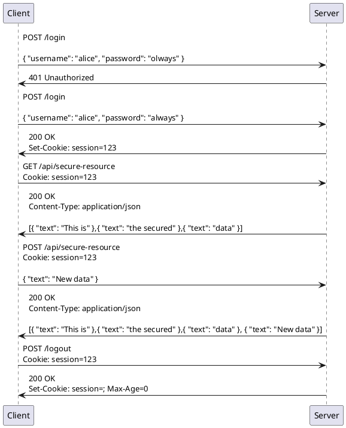
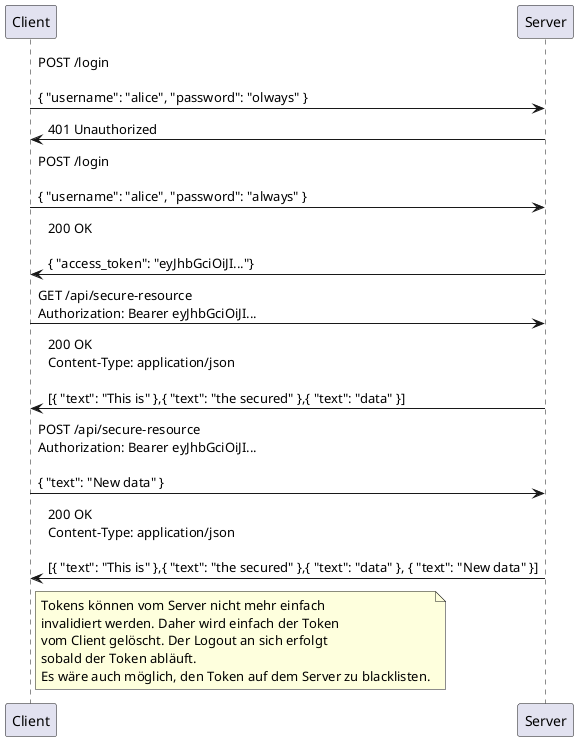

# ANSWERS

## Stateless Authentication

> Was bedeutet es, dass mit JWT ein stateless Ansatz verfolgt wird?

Das bedeutet, dass sämtliche Informationen, die für eine Request benötigt werden in der Request beinhaltet sind, also der Server kein Vorwissen über diese Session benötigt. Bei JWT wird dies durch das Signieren des Tokens mit einem Secret Key erreicht. Der Server kann das Token entschlüsseln und die Informationen darin überprüfen, ohne dass er eine Datenbankabfrage benötigt.

## Sequenzdiagramme

> Erstellen Sie mit PlantUML zwei Sequenzdiagramme, welche die HTTP Kommunikation zwischen Frontend und Backend bei der Verwendung von Session-Cookies bzw. Tokens illustrieren. Die beiden Diagramme sollten den folgenden Ablauf der Kommunikation darstellen:
>
> 1. Loginversuch mit korrektem User aber Tippfehler im Passwort
> 2. Erneutes Login mit korrektem User und Passwort
> 3. Lese-Zugriff auf die geschützte Ressource
> 4. Schreib-Zugriff auf die geschützte Resource
> 5. Logout
>    Der Fokus der Darstellung sollte auf den Authentifizierungs-relevanten Inhalten (Header + Body) und der korrekten Verwendung der Status Codes liegen. Beschreiben Sie kurz die wesentlichen Unterschiede der beiden Ansätze.

### Session-Cookies

### Tokens

