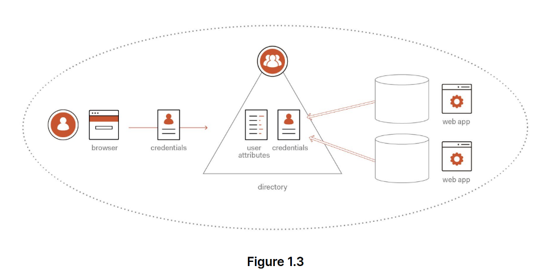
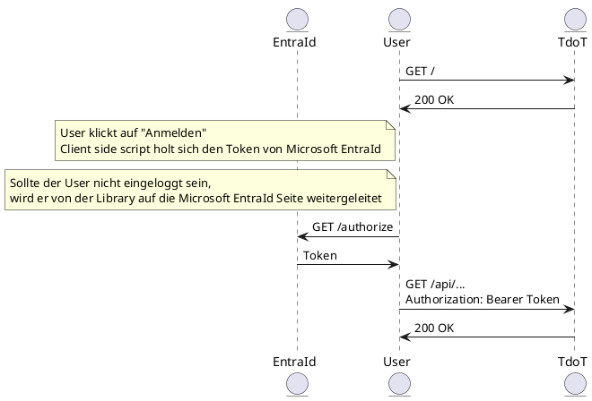

# ANSWERS

## Password Sharing

> Sie entwickeln eine neue App, die es ermöglichen sollte, die Assignments aus Teams mit den jeweiligen Abgabezeitpunkten automatisch in einen Google Kalender zu übertragen. Damit sollte sichergestellt werden, dass keine Hausübungen vergessen werden.
> Ihr Kollege schlägt vor, die Zugangsdaten für beide Systeme in der App zu verspeichern. Diskutieren Sie, welche Probleme dabei entstehen können.

-   Unsere Applikation muss die Passwörter reversibel speichern, nicht wie üblich als Hash - Sollten unsere Systeme angegriffen werden können die Passwörter vom Angreifer einfach ausgelesen werden
-   Unsere Applikation hat vollen Zugriff auf sowohl Google Account als auch Microsoft Account der Nutzer. Potentiell (hoffentlich) werden Nutzer dadurch abgeschreckt.

## Directories

> Erklären Sie wozu im Bereich des Identity Managements Directories zum Einsatz kommen. Welche Vorteile ergeben sich durch deren Verwendung?

Directories werden zur zentralisierten Identitätsverwaltung verwendet.
Nutzer können sich mit ihrer Directory bei verschiedenen Services anmelden, der Lebenszyklus des Nutzers wird ausschließlich durch die Directory verwaltet.

## Authorization Flow

> In Abbildung 1.7 wird ein Ablauf dargestellt, wie sich der User authentifiziert und in weiterer Folge einen Access Token für den Zugriff auf eine API erhält.
> In der SYP Web Applikation wird im wesentlichen bei der Anmeldung mittels Schul-Account derselbe Ablauf durchlaufen. Als Authorization Server wird dabei Microsoft Entra Id verwendet. Erstellen Sie ein UML Sequenzdiagramm, welches denselben Ablauf - umgemünzt auf die SYP Applikation - darstellt.

> Was versteht man in diesem Zusammenhang unter einem consent?

Consent ist die Zustimmung des Nutzers, dass die Applikation auf seine Daten (und auf welche davon) zugreifen darf. Dieser Schritt wird seitens des Authorization Servers durchgeführt.
