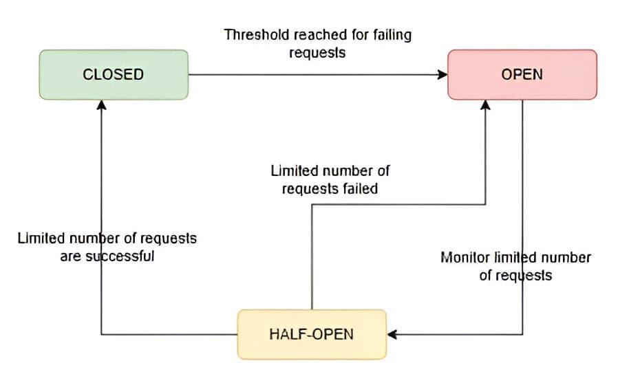

# Microservices Interaction - ANSWERS

## Microservices - Distribution

> Als Nachteil einer Microservice Architektur wird Verteiltheit (distribution) genannt. Diskutieren Sie, welche neuen Probleme man sich in dieser Hinsicht stellen muss, wenn man von einer monolithischen Architektur auf eine Microservice Architektur migriert.

-   Performance
    Durch großen physischen Abstand zwischen den Nodes, auf denen die Services laufen, kann es zu Latenzproblemen kommen, wenn ein Service Daten von einem anderen Service braucht, der nicht auf der gleichen Node läuft.
-   Verlässlichkeit
    Durch die Verteilung der Services auf verschiedene Nodes kann es zu Ausfällen kommen, die in einer monolithischen Architektur nicht auftreten würden.

## Circuit Breaker Pattern

> Beschreiben Sie in eigenen Worten das Circuit Breaker Pattern. Woher kommt der Name dieses Patterns? Welche Zustände kennt der Circuit Breaker und unter welchen Bedingungen kommt es zu den Übergängen zwischen den Zuständen?

Das Circuit Breaker pattern funktioniert ähnlich wie eine Sicherung im Stromnetz. Sobald zu viele Anfragen fehlerhaft oder nicht bearbeitet werden, öffnet sich die Sicherung und weitere Anfragen werden vorerst nicht entgegengenommen. Nach einem Timeout wird die Sicherung "halb" geöffnet und Anfragen genau überwacht.
